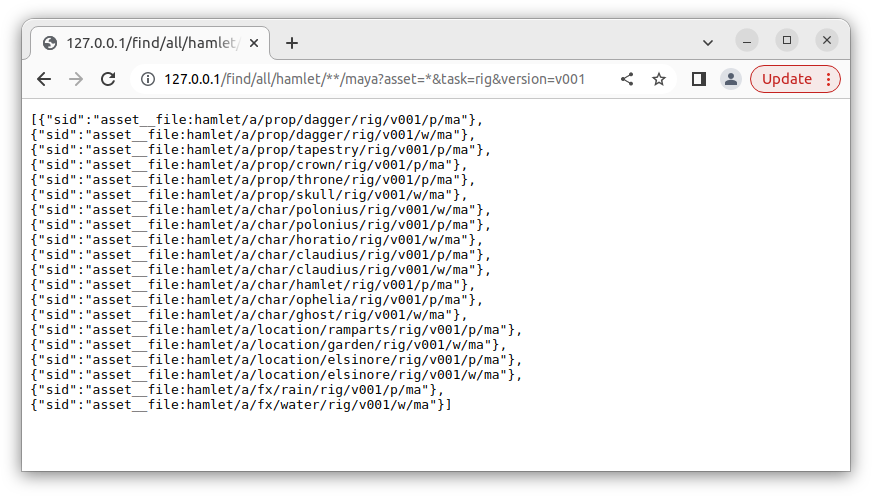

# Spil network deployment

Client / Server deployment of Spil is still experimental, and work in progress.

## Server side Spil

A fastapi powered Spil REST API is currently under development.

It allows access to the Crud interface via a rest api.
- /find/{config}/{sid}
- /get/{config}/{sid}
- /write/{config}/{sid}



### Running the API

- Either from the cloned repo:  
  (includes creation of test data)  
```shell
git clone https://github.com/MichaelHaussmann/spil.git
cd spil
python -c "import spil;import hamlet_scripts.save_examples_to_mock_fs as mfs;mfs.run()"
cd spil_server/fastapi/app
uvicorn main:app --reload
```

The API will run on [http://127.0.0.1:8000/find](http://127.0.0.1:8000/find) and [http://127.0.0.1:8000/get](http://127.0.0.1:8000/get)    
Example: [http://127.0.0.1:8000/find/all/hamlet/a/**/maya?asset=*&task=rig&version=v001](http://127.0.0.1:8000/find/all/hamlet/a/**/maya?asset=*&task=rig&version=v001)  
  

- Using Docker compose
```shell
git clone https://github.com/MichaelHaussmann/spil.git
cd spil
docker compose up -d
```
This will build `spil/spil_server/docker/Dockerfile`
And run as defined in `spil/docker-compose.yml`  

The API will run on [http://127.0.0.1/find](http://127.0.0.1/find) and [http://127.0.0.1/get](http://127.0.0.1/get)    
Example: [http://127.0.0.1/find/all/hamlet/a/**/maya?asset=*&task=rig&version=v001](http://127.0.0.1/find/all/hamlet/a/**/maya?asset=*&task=rig&version=v001)  


### Production config

Check out comments in the Dockerfile `spil/spil_server/docker/Dockerfile`  
and the docker-compose `spil/docker-compose.yml`  
It is possible to map a production configuration onto the docker config folder. 


## Client Side Spil

A FindInSpilRest Finder is also in development. 

It is able to consume the Spil rest API.
This Finder can replace any other finder, and be used without any change in the code.

**This is not currently implemented**


