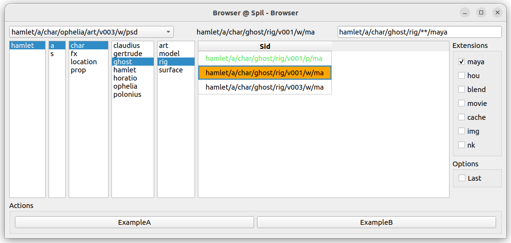
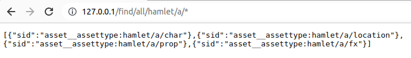

# Spil, the Simple Pipeline lib.

[](https://github.com/MichaelHaussmann/spil)

Spil provides a simple, hierarchical, path-like, unique identifier for every entity or file of a CG production pipeline.<br>      
An intuitive API is built around this identifier, including glob-like query, CRUD data access and path resolving.  

## Motivation

Spil was created to:
- uniquely and intuitively identify all entities of a pipeline.
- aggregate different data sources (file systems, asset manager, DCCs, etc.)
- have a universal, versatile and lightweight "Entity" object for pipeline operations, at a higher abstraction level than a file path.   
- propose an easy and intuitive API, to empower TDs and technical artists to connect to the pipeline.  


## Usage

### Unique Hierarchical Identifier

The identifier is called the "**Sid**" - for "Scene Identifier".

Examples: 

- Sid of sequence 30 shot 10 in the project "Hamlet":
```
"hamlet/s/sq030/sh0010"
```

- Sid for the maya mb file of character Ophelia's modeling, published version v002:
```
"hamlet/a/char/ophelia/modeling/v002/p/mb" 
```

### Data Dictionary with a Type 

Once resolved, the Sid is a dictionary associated to a type.
Keys and types are fully configurable.

Examples:

- type `shot__task` :
```
{ 
  'project': 'hamlet', 
  'type': 's', 
  'sequence': 'sq030', 
  'shot': 'sh0010',
  'task': 'animation' 
}
```

- type `asset__version` :
```
{ 
  'project': 'hamlet', 
  'type': 'a', 
  'cat': 'props', 
  'name': 'skull',
  'task': 'modeling',
  'version': 'v008' 
}
```

### Intuitive API

Sid creation and manipulation

```python
from spil import Sid

# create a Sid from scratch
task = Sid("hamlet/s/sq030/sh0010/render")
# a task sid: hamlet/s/sq030/sh0010/render

# create a Sid by changing values
anim_task = task.get_with(task="anim")          
# task sid: hamlet/s/sq030/sh0010/anim 

# create a Sid from a Sids hierarchy 
sequence = task.get_as('sequence')              
# sequence sid: hamlet/s/sq030

# another way
shot = task.parent                              
# shot sid: hamlet/s/sq030/sh0010 
```

Creation with a uri-query or dictionary
```python
from spil import Sid
seq = Sid(query="project=hamlet&type=s&sequence=sq010")  # uri-query        
seq = Sid(fields={'project': 'hamlet', 'type': 's', 'sequence': 'sq010'})  # dict
```

Data can be accessed in multiple ways: by key, as a complete dictionary, as string or uri-query.
```python
from spil import Sid 
shot = Sid("hamlet/s/sq030/sh0010")

# get a field of the sid by key
shot.get("sequence")   
# sq030

# as a dictionary
shot.fields            
#  { 'project': 'hamlet', 'type': 's', 'sequence': 'sq030', 'shot': 'sh0010' }

# as a Query
shot.as_query()          
# "project=hamlet&type=s&seq=sq030&shot=sh0010"

# "uri": type and string
shot.uri        
# "shot__shot:hamlet/s/sq030/sh0010" 
```

### Path Resolver

The Sid can be resolved to and from paths.  
Multiple configurations can co-exist.  
For example "local", "server", "linux", etc. paths.    

```python
from spil import Sid

# creating a Sid from path
scene = Sid(path="/projects/hamlet/chars/ophelia/modeling/v002/publish/ophelia_model.mb")

print(scene)            
# "hamlet/a/chars/ophelia/modeling/v002/p/mb"

# returning default path
path = scene.path()     
# "/projects/hamlet/chars/ophelia/modeling/v002/publish/ophelia_model.mb"

# returning path from "server" configuration
path = scene.path("server")     
# "/server/projects/hamlet/chars/ophelia/modeling/v002/publish/ophelia_model.mb"
```

Example in maya, with an opened scene file:
```python
import maya.cmds as cmds
from spil import Sid

# Get the current scene's path
scene_path = cmds.file(query=True, sceneName=True)

# build the Sid
scene = Sid(path=scene_path)

if scene:  # A sid that is not resolvable (not conform), has no type, and evaluates to False.
    print(scene.get('project'))  # hamlet
    print(scene.get('version'))  # "v002"
else:
    print("opened scene is not a pipeline scene")
```

### Data access and Pipeline workflows

Sid wraps common requests, that are delegated to configurable data sources (Finder and Getter).

```python
from spil import Sid
task_sid = Sid("hamlet/s/sq030/sh0010/layout") 

task_sid.exists()                 # True
task_sid.get_last('version')      # "hamlet/s/sq030/sh0010/layout/v003"
```

Sids API can intuitively express common pipeline workflows. 
```python
from spil import Sid
task_sid = Sid("hamlet/s/sq030/sh0010/layout") 

if task_sid.exists():
  print( task_sid.get_last('version').get_attr('comment') )     # "Changed camera angle."

# match() is handy for hooks and action overrides
if task_sid.match('hamlet/s/*/*/layout/**/maya'):  
    # do something specific for hamlet maya layouts
    ... 
```

### Finding Sids: glob-like search syntax  

Considering the Sid a middleware and data abstraction layer, Spil proposes an intuitive glob-like search syntax.
 
It is string based, and uses operators:
- \*   : star search
- **  : recursive star search
- \>   : last
- \,   : "or"  
- configurable aliases ("movie" -> "mov,avi,mp4", "maya" -> "ma,mb") 
  
#### Search Examples

- "All the Shots of sequence sq030" ?
```
"hamlet/s/sq030/*"
```

- "All the published maya files of Ophelias modeling" ?
```
"hamlet/a/chars/ophelia/model/*/p/maya"
```

- "Last published render movies for the project hamlet" ?
```
"hamlet/s/**/render/>/p/movie"
```

- "All cache files for hamlet's sequence 30, shot 10" ?
```
"hamlet/s/sq030/sh010/**/cache"
```

#### Query in search 

Query Syntax can be used to add search filters on yet untyped searches

- "All published Movie files for hamlet's sequence 30" ?
```
"hamlet/s/sq030/**/movie?state=p"
```

- "All published hip files for hamlet's sequence 30, animation or layout" ?
```
"hamlet/s/sq030/**/hip?state=p&task=animation,layout"
```

  
### Finders

To launch search queries, Spil implements `Finder` classes that access different data sources.  

- **FindInPaths**: to search the file system
- **FindInList**: to search a list
- **FindInCache**: to search a cache
- **FindInAll**: to search other Finders, depending on a configuration
- **FindInShotgrid**: to search Shotgrid

All Finders implement `find()`, `find_one()` and `exists()`.

```python
# Look up the last published versions for given shot, on the File System 
from spil import FindInPaths as Finder
for sid in Finder().find("hamlet/s/sq010/sh0010/**/>/p/movie"):
  print(sid)

# "hamlet/s/sq010/sh0010/layout/v012/p/mov"
# "hamlet/s/sq010/sh0010/animation/v003/p/avi"
# "hamlet/s/sq010/sh0010/render/v001/p/mov"
# ...
```
  
The `FindInShotgrid` is an example Finder implementation.  
It may need to be adapted, depending on the production's Shotgrid usage.      

It is planned to implement other Finders, for example for MongoDB and CGWire kitsu.    

 
## UI
 
Spil can be used with the spil_ui.browser.  

[](https://github.com/MichaelHaussmann/spil_ui)
  
**Spil_UI** is a Qt browser UI, built on top of Qt.py (PySide/PySide2).   
Navigating through the columns builds a **"Search Sid"** and calls a **Finder**.    
It is possible to run actions on the currently selected Sid.  
 
**spil_ui** is a separate repository (in the process of being released).   

## REST API

Spil can run server side.



*(REST API and docker under development)*

## Flexible and configurable

Spil is a library, not a framework.<br>  
It is fully configurable. It adopts your naming conventions, and does not enforce specific workflows.   
It easily integrates and connects onto existing pipelines.      

The Sid is based on the [resolva](https://github.com/MichaelHaussmann/resolva) resolver.  

Sid config example:
```
'asset__file':            '{project}/{type:a}/{assettype}/{asset}/{task}/{version}/{state}/{ext:scenes}',
'shot__file':             '{project}/{type:s}/{sequence}/{shot}/{task}/{version}/{state}/{ext:scenes}',
'shot__movie_file':       '{project}/{type:s}/{sequence}/{shot}/{task}/{version}/{state}/{ext:movies}',
```

Paths config example:
```
'asset__file':             '{@project_root}/{project}/PROD/{type:ASSETS}/{assettype}/{asset}/{task}/{version}/{assettype}_{asset}_{task}_{state}_{version}.{ext:scenes}',
'shot__file':              '{@project_root}/{project}/PROD/{type:SHOTS}/{sequence}/{sequence}_{shot}/{task}/{version}/{sequence}_{shot}_{task}_{state}_{version}.{ext:scenes}',
'shot__movie_file':        '{@project_root}/{project}/PROD/{type:SHOTS}/{sequence}/{sequence}_{shot}/{task}/{version}/EXPORT/{sequence}_{shot}_{task}_{state}_{version}.{ext:movies}',   
```

The Data Source is configurable depending on the given Sid or Sid type.
```
'project': finder_projects,
'shot_task': FindInShotgrid(),
'default': FindInPaths(),
```

## Installation

Spil works in Python >=3.7.  
Spil is available on pypi and can be installed using `pip install spil`,  
or from github `pip install git+https://github.com/MichaelHaussmann/spil.git`

More about installation, configuration and testing: [spil.readthedocs.io](https://spil.readthedocs.io).


## Interested ?

We'd love to hear from you.  
We are interested in any kind of feedback: comments, questions, issues, pull requests.  

Spil is released under Lesser GPL and is usable in closed source commercial applications.
Other licensing is possible, please get in touch.

Don't hesitate to contact us : [spil@xeo.info](mailto:spil@xeo.info).  
We will be happy to respond.  
<br>
  


