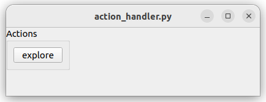

# Spil UI Technical Notes

For usage and general understanding see [Usage](spil_ui_usage.md).

## General architecture

The Browser window launches searches for a search sid.
The resulting "current Sid" is represented in clickable parts:
- on the lefts the "entity" columns, one column for each part
- on the right the "version" table, one line for each Sid

A new search is launched when either
- a column selection changes
- the "Search Sid" field is edited
- the sid history (last used Sids) is changed

An ActionHandler uses the selected Sid to handle actions.
Typically showing Buttons and running functions.

## Browser

The "Browser" has 3 areas:
- Top: "Sids": Last used Sids / Current Sid / Search Sid
- Middle: "Main": Entity lists / Version table / Options
- Bottom: "Actions": Buttons

### Browser search-cycle

The Search circle is roughly:
search -> results -> selection / input -> current -> search

In detail the circle is:
- start with a search sid
- potentially add search terms to search sid, typically : /* at the end
- boot / fill entities and versions with search sid and search results
- select with values from search sid by default -> we have a current sid 
- wait for user input -> we update the current sid
- on signal, we update the search sid, current -> search, and loop again

### Browser UI : Entities & Versions

Builds "Entity" (Asset or Shot) columns.

#### Entities columns

The columns are list_widgets.
They are build in a loop, according to the parts of the search_sid.

This method is followed by "build_versions".
Build_entities stops either:
- when there are no parts left (eg "hamlet/s/sq010" has 3 parts)
- when it hits a "cut" key (as configured in "basetype_to_cut")

It then goes to "build_versions"
- if "/**" is in the search

#### Version table

Table widget for the last part of the Sid.

The table is built and filled after "build_entities" has finished.

The current search sid is modified to add extension and "last", as given by the checkboxes.

### "Sticky" or "Reset" Navigation mode

A search is either "sticky" or "reset".

Sticky: the current search is kept, only updated with the clicked sids keytype (last key)
Reset: the clicked sid replaces the current search all over.

If the click comes from the version table, it is "reset".
Sticky search is possible only if the current search is typed.

If the clicked sids keytype is of certain type, as defined in "search_reset_keys", we use "reset".

### Action Handler

The ActionHandler is a way to add actions to the Browser.

On each Sid selection in the browser, the ActionHandler's update method is called, with the given selection.
The handler can then accordingly construct buttons and other features.

The ActionHandler can be run as a standalone for testing:  

During startup, the Browser ask the configuration for an ActionHandler object.

The ActionHandler is typically a QtWidget that gets inserted into the Browser window,
and that interacts with it.
The goal is to be able to execute Actions on selected Sids.

The process is:
- The configuration instantiates an ActionHandler and returns it to the Browser.
- Browser calls the ActionHandler.init() and passes itself, the self.central_layout, and a callback function.
- on each Sid update (new Sid selection), the Browser calls ActionHandler.update() and passes the selected Sid.
- the ActionHandler can call the callback, optionally passing a Sid.

The ActionHandler implements Buttons (and potentially other Qt Widgets),
and handles the Button pushes and action execution.
The Browser only serves for browsing.

An example ActionHandler is shipped in `spil_hamplet_conf/actions`.

### "Dialogs" tools

`spil_ui.utils.dialogs` implements simple functions for pop-up windows, 
for universal usages (inform, warn, confirm, choice, etc.) 