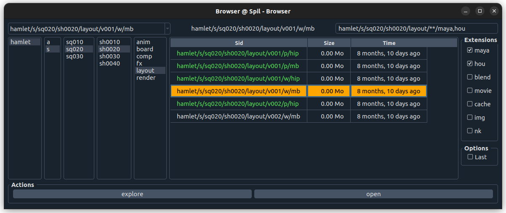

# Spil UI Usage

## Top part

### Last Used Sids

Top left. Stores 10 last used Sids.

### Current Sid

Top Middle. Currently selected Sid.  
This Sid will be used for the **Actions** (buttons below).

### Search Sid

Top right. The current search Sid.  
Changes when the user clicks in the middle part, or checks a box.  
Can also be hand edited.  
It is possible to add a **query**, for example try:  
`hamlet/a/char/ophelia/**?task=rig`

## Middle / Main part

### Entity columns

Left Side. Dynamically building columns to traverse entities.

### Sid table

Right Side. Final part of the search result shown as a table of Sid versions with attributes.

## Bottom

### Action Buttons

Implemented in an **Action Handler**.  
Depending on the **Current Sid**, the available actions vary, and buttons get updated.  
The current Sid is sent to the Action when the button is clicked.

